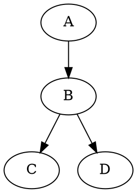
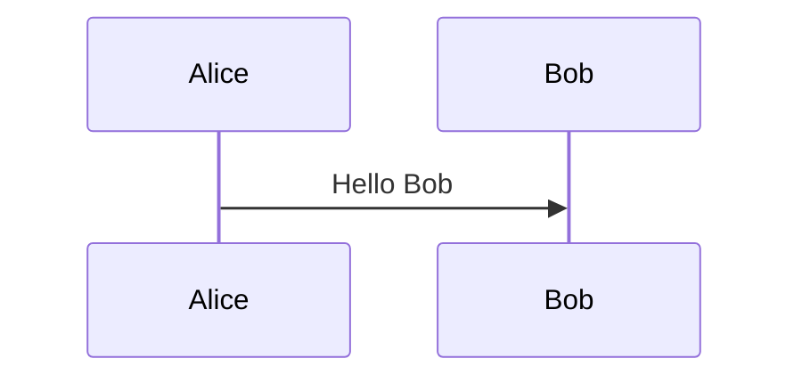

# Required vscode extensions

* Markdown Preview Enhanced
* Markdown All in One

# Example of DOT

```dot
digraph G {
  A -> B
  B -> C
  B -> D
}
```

# Example of mermaid that is NOT rendered with offline html (MUST USE CDN HOSTED)

```mermaid
sequenceDiagram
  Alice ->> Bob: Hello Bob
```
